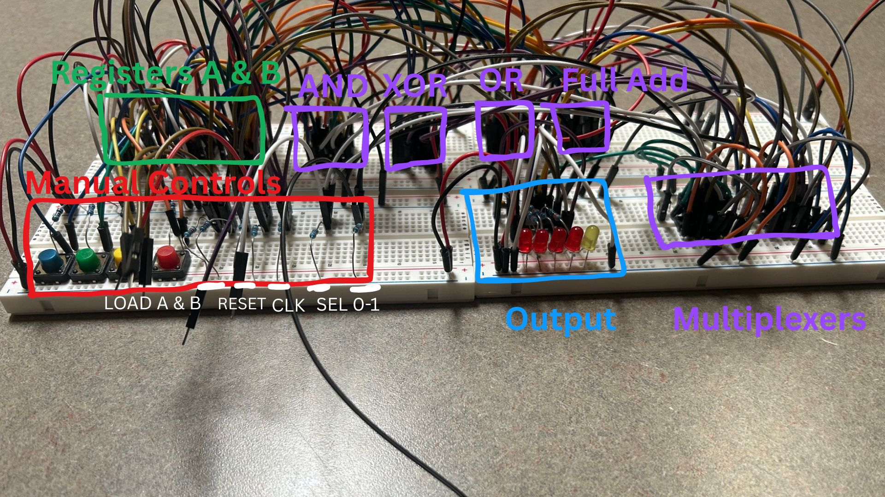
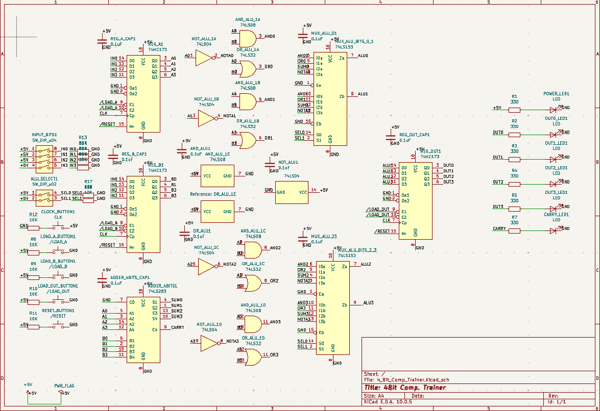
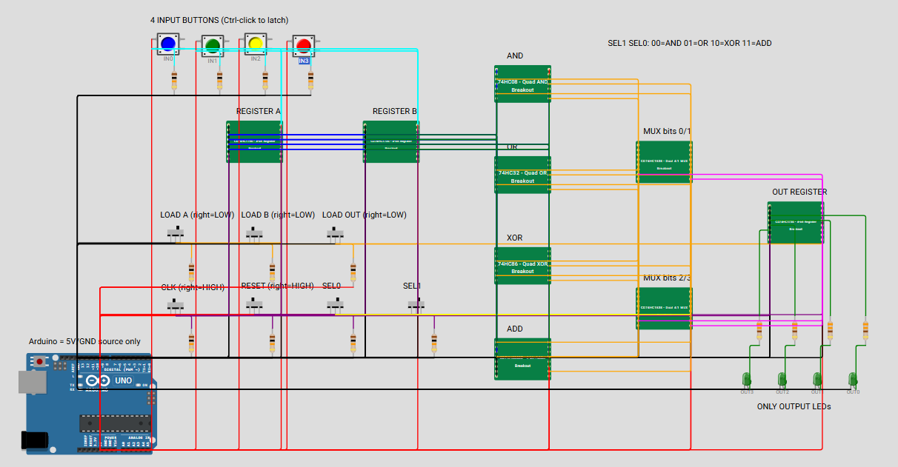

# 4-Bit ALU Trainer

A breadboard trainer for trying four operations on two stored 4-bit numbers: **AND, OR, XOR, and addition**. Buttons set the input bits, registers hold A and B, two select lines choose the operation, and an output register captures the result. This project has its own repository, separate from NAND.



## How it works

```text
4 input buttons ──┬──> A register ──┬──> AND / OR / XOR / ADD ──> multiplexers ──> OUT register ──> LEDs
                 └──> B register ──┘                    SEL1, SEL0
                       LOAD A/B                            LOAD OUT, CLK, RESET
```

The same four input buttons load A and B at different times. The operation runs on the stored values, and `LOAD OUT` captures the selected result on a clock pulse. The simulation shows four result LEDs; the schematic also includes a carry indicator for the adder.

| SEL1 | SEL0 | Selected operation |
|:---:|:---:|---|
| 0 | 0 | A AND B |
| 0 | 1 | A OR B |
| 1 | 0 | A XOR B |
| 1 | 1 | A + B (four result bits) |

## Physical build

The annotated breadboard photo above identifies the major sections. The manual controls are grouped at the front, the logic and adder sit between the input registers and multiplexers, and the LEDs show the output. The physical schematic includes a separate carry LED.

More build photos can go in [`docs/photos`](docs/photos). To show one here, add an image to that folder and use a line such as ``.

## KiCad schematic



The schematic screenshot shows the two input registers, gate and adder paths, multiplexers, output register, controls, and LED resistors. The editable KiCad project files have **not** been included yet. Put the `.kicad_pro`, `.kicad_sch`, and any `.kicad_pcb` files in [`hardware/kicad`](hardware/kicad) when they are ready; the screenshot is a reference, not an editable schematic.

## Wokwi simulation



The [`simulation`](simulation) folder contains `diagram.json`, `sketch.ino`, six custom chip models, and [`EXPECTED_TESTS.txt`](simulation/EXPECTED_TESTS.txt). The Arduino Uno supplies simulated 5 V and ground only; the logic chips perform the operation.

### Run it

1. Create a new Arduino Uno project in Wokwi.
2. Add C custom chips named `hc173`, `hc153`, `hc283`, `hc08`, `hc32`, and `hc86`.
3. Replace each generated `.chip.c` and `.chip.json` with the matching file from [`simulation`](simulation).
4. Replace the project's `diagram.json` and `sketch.ino` with the copies in that folder.
5. Start the simulation.

**Live Wokwi project:** Add the project URL here when published.

The `IN0`–`IN3` buttons are momentary; Ctrl-click latches a button while entering a multi-bit value. `LOAD A`, `LOAD B`, and `LOAD OUT` are active low in the simulation (right = load, left = idle). Move `CLK` right then left for one pulse. Move `RESET` right then left to clear the registers.

### Example: A = `0101`, B = `0011`

1. Pulse `RESET`.
2. Set the input to `0101`, enable `LOAD A`, pulse `CLK`, then disable `LOAD A`.
3. Set the input to `0011`, enable `LOAD B`, pulse `CLK`, then disable `LOAD B`.
4. Choose `SEL1` and `SEL0`, enable `LOAD OUT`, pulse `CLK`, then disable `LOAD OUT`.

| Selection | Operation | Four-bit result |
|:---:|---|:---:|
| `00` | AND | `0001` |
| `01` | OR | `0111` |
| `10` | XOR | `0110` |
| `11` | ADD | `1000` |

## Repository contents

| Folder | Contents |
|---|---|
| [`simulation/`](simulation) | Wokwi circuit, chip models, and expected results |
| [`hardware/kicad/`](hardware/kicad) | Space for editable KiCad files |
| [`docs/photos/`](docs/photos) | Annotated breadboard and schematic images; room for more build photos |
| [`docs/simulation/`](docs/simulation) | Wokwi overview; room for more test screenshots |

The simulation models three CD74HC173E registers, 74HC08/32/86 gates, a CD74HC283E adder, and two CD74HC153E multiplexers. Check the physical wiring and power connections against the eventual editable schematic before powering a rebuilt circuit.
